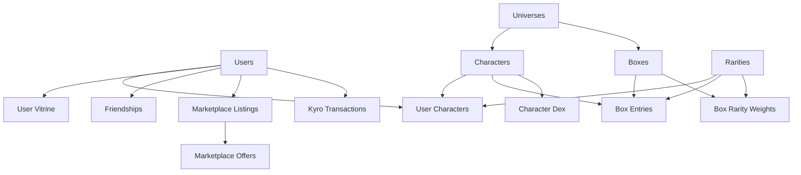

# 🎮 Boxes Legends
### Sistema de Colecionáveis Gacha Multiplataforma

<div align="center">


</div>

---

## 🌟 Visão Geral

**Boxes Legends** é uma experiência completa de sistema gacha que combina a emoção de colecionáveis digitais com interações sociais profundas. Desenvolvido para funcionar tanto em **desktop (JavaFX)** quanto **mobile (Android)**, oferece uma jornada imersiva de coleta, comércio e socialização.

### ✨ Destaques do Sistema

- 🎲 **Sistema Gacha Avançado** com probabilidades dinâmicas
- 🏆 **Sistema de Raridades** de Comum até Mítico (6 níveis)
- 👥 **Rede Social Integrada** com sistema de amizades
- 💎 **Marketplace Inteligente** com ofertas priorizadas para amigos
- 📱 **Multiplataforma** - Uma experiência, duas plataformas
- 🎯 **Sistema de Quality** - Cada personagem é único

---

## 🎯 Funcionalidades Principais

### 🎁 Sistema Gacha Inteligente
- **Caixas Temáticas** organizadas por universos
- **Probabilidades Transparentes** com pesos configuráveis
- **Sistema de Quality** único para cada personagem (0.00000001 - 1.0)
- **Animações Especiais** para drops raros

### 👥 Experiência Social
- **Sistema de Amizades** com status (pendente/aceito/bloqueado)
- **Vitrine Personalizada** - exiba seus 3 melhores personagens
- **Ranking Global** baseado no valor da coleção
- **Ofertas Prioritárias** no marketplace para amigos

### 💰 Economia Robusta
- **Moeda Virtual (Kyros)** com sistema de transações rastreado
- **Marketplace Dinâmico** para venda e troca
- **Sistema de Ofertas** com negociação direta
- **Histórico Completo** de todas as transações

### 📊 Progresso e Coleção
- **Character Dex** - catálogo completo de personagens
- **Silhuetas Misteriosas** para personagens não obtidos
- **Estatísticas Detalhadas** de qualidade e raridade
- **Inventário Limitado** (200 slots) para estratégia

---

## 🛠️ Arquitetura Técnica

<div align="center">

| **Camada** | **Desktop** | **Mobile** |
|------------|-------------|------------|
| **Interface** | JavaFX + FXML | Android SDK + XML |
| **Lógica** | Java 21+ | Java 21+ |
| **Banco** | SQL Server (JDBC) | SQL Server (JDBC) |
| **Build** | Gradle | Gradle |

</div>

### 🎨 Padrões de Projeto Utilizados
- **MVC (Model-View-Controller)** para separação clara de responsabilidades
- **Service Layer** para lógica de negócio centralizada
- **Repository Pattern** para acesso a dados
- **Factory Pattern** para criação de componentes UI

---

## 📊 Modelo de Dados

O sistema possui **14 tabelas** principais que gerenciam:



### 🔧 Funcionalidades Avançadas do Banco
- **Triggers Automáticos** para atualização do Character Dex
- **Stored Procedures** para operações complexas (gacha, marketplace)
- **Controle de Inventário** com limite automático de 200 slots
- **Sistema de Transações** com rollback automático em caso de erro

---

## 🚀 Instalação e Configuração

### 📋 Pré-requisitos
```bash
☑️ Java JDK 21+
☑️ SQL Server 2016+ 
☑️ Android SDK 24+ (para mobile)
☑️ Gradle 7.0+
☑️ 4GB RAM mínimo
```

### ⚡ Configuração Rápida

1. **Clone o repositório**
   ```bash
   git clone https://github.com/seuusuario/boxes-legends.git
   cd boxes-legends
   ```

2. **Configure o banco de dados**
   ```bash
   # Execute o script SQL no SQL Server
   sqlcmd -S localhost -i src/main/resources/db/gacha_db.sql
   
   # Configure as credenciais em config/database.properties
   database.url=jdbc:sqlserver://localhost:1433;databaseName=gacha_db
   database.user=seu_usuario
   database.password=sua_senha
   ```

3. **Build e execução**
   ```bash
   # Desktop (JavaFX)
   ./gradlew run
   
   # Android
   ./gradlew assembleDebug
   ./gradlew installDebug
   ```

---

## 🎮 Como Jogar

### 🏁 Primeiros Passos
1. **Crie sua conta** com Gmail e escolha um nome de perfil
2. **Receba 500 Kyros** de bônus inicial
3. **Explore as caixas** disponíveis nos diferentes universos
4. **Abra sua primeira caixa** e descubra seu personagem inicial

### 🎯 Estratégias Avançadas
- **Gerencie seu inventário** - apenas 200 slots disponíveis
- **Foque em universos** específicos para coleções temáticas  
- **Use o marketplace** para trocar duplicatas por personagens raros
- **Cultive amizades** para ter prioridade nas melhores ofertas

---

## 🌐 Capturas de Tela

<div align="center">

### Desktop (JavaFX)


### Mobile (Android)


</div>

---

## 🤝 Contribuindo

Adoramos contribuições! Veja como você pode ajudar:

### 🐛 Reportando Bugs
1. Verifique se o bug já foi reportado nas [Issues](https://github.com/seuusuario/boxes-legends/issues)
2. Crie uma nova issue com detalhes do problema
3. Inclua logs, screenshots e passos para reproduzir

### 💡 Sugerindo Funcionalidades
1. Abra uma issue com a tag `enhancement`
2. Descreva detalhadamente sua ideia
3. Explique como ela melhoraria a experiência do usuário

### 🔧 Desenvolvendo
```bash
# Fork o projeto
# Crie uma branch para sua feature
git checkout -b feature/MinhaNovaFuncionalidade

# Faça suas mudanças e commit
git commit -am 'Adiciona nova funcionalidade incrível'

# Push para sua branch
git push origin feature/MinhaNovaFuncionalidade

# Abra um Pull Request
```

---

## 📈 Roadmap

### 🎯 Versão 1.0 (Q1 2025)
- [ ] Sistema gacha básico
- [ ] Marketplace e economia
- [ ] Sistema de amizades
- [ ] Interface mobile polida
- [ ] Testes automatizados
- [ ] Documentação completa

### 🚀 Versão 1.1 (Q2 2025)
- [ ] Sistema de missões diárias
- [ ] Eventos temporários especiais
- [ ] Chat em tempo real
- [ ] Sistema de guilds/clãs
- [ ] Rankings por categorias

### 🌟 Versão 2.0 (Q3 2025)
- [ ] Modo battle/combate
- [ ] Sistema de crafting
- [ ] Integração com redes sociais
- [ ] Conquistas e badges
- [ ] API pública para desenvolvedores

---

## 📊 Estatísticas do Projeto

<div align="center">


</div>

---

## 🏆 Reconhecimentos

- **SQL Server** pela robustez do sistema de banco de dados
- **JavaFX** pela versatilidade na criação de interfaces desktop
- **Android SDK** pela plataforma móvel poderosa
- **Comunidade Java** pelo suporte contínuo

---

## 📞 Suporte e Contato

<div align="center">

[](mailto:jpmoraes.mendes22@gmail.com)
[](https://github.com/seuusuario/boxes-legends)
[](docs/README.md)

</div>

### 🎯 Links Úteis
- **[📖 Documentação Técnica](docs/technical.md)**
- **[🎮 Guia do Jogador](docs/player-guide.md)**
- **[🔧 API Reference](docs/api.md)**
- **[❓ FAQ](docs/faq.md)**

---

## 📜 Licença

Este projeto está licenciado sob a **MIT License** - veja o arquivo [LICENSE](LICENSE) para detalhes.

---

<div align="center">

### 🌟 **Transforme sua experiência de coleção em algo lendário!**

**⭐ Se você gostou do projeto, não esqueça de dar uma estrela!**


*Made with ❤️ for the gaming community*

</div>